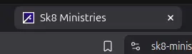

LightNet allows you to set a favicon — the small icon displayed in browser tabs and bookmarks.



When selecting a favicon, ensure it maintains good contrast on both light and dark backgrounds. 
Additionally, remember that favicons are usually very small, so avoid intricate details that may not render clearly.

#### Basic method (not recommended)

The simplest way to set a favicon is by placing a `favicon.ico` file in your project's `public/` folder.  
This file is served at `/favicon.ico`, a standard location recognized by all browsers. (Recommended size 32 x 32 pixels)

#### Recommended method

For a better user experience, 
use [multiple icon formats tailored to different platforms](https://evilmartians.com/chronicles/how-to-favicon-in-2021-six-files-that-fit-most-needs). 
This approach ensures optimal display quality across devices. Reference the icons in your `astro.config.mjs` file as follows:

```js title="astro.config.mjs" ins={5-19}
export default defineConfig({
  integrations: [
    lightnet({
      // ...
      favicon: [
        {
          rel: "icon",
          href: "favicon.ico",
          sizes: "32x32",
        },
        {
          rel: "icon",
          href: "icon.svg",
        },
        {
          rel: "apple-touch-icon",
          href: "apple-touch-icon.png",
        },
      ]
    }),
  ]
})
```

#### Required files

Place these files in your `public/` folder:

- **`favicon.ico`**: A fallback icon for all browsers. Recommended size: 32x32 pixels.
- **`icon.svg`**: A vector graphic for high-resolution displays. 
- **`apple-touch-icon.png`**: Used for home screen shortcuts on iPhones/iPads. Recommended size: 180x180 pixels.


