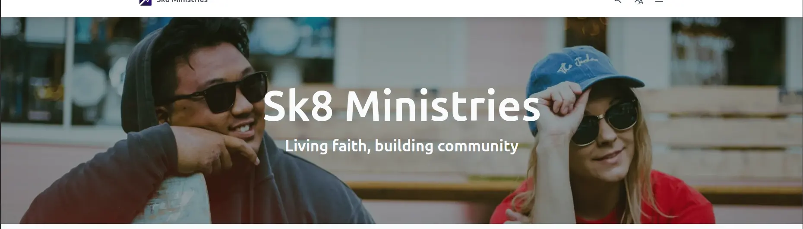

import { Aside } from "@astrojs/starlight/components"


The hero image is the eye catcher that users see when they visit your page. 
It is a large image that takes up the full width of the screen with a big centered title on top of it.



You can add a hero image to your page by adding the following code:

```astro
---
import { Page, HeroSection } from "lightnet/components"
import heroImage from "../../assets/hero.jpg"

const { t } = Astro.locals.i18n
---

<Page>
    <HeroSection
        image={heroImage}
        title={t("x.hero.title")}
        subtitle={t("x.hero.subtitle")}
        titleSize="xl"
        subtitleSize="xl"
    />
</Page>
```

Make sure you add your image to the `src/assets` folder and import it at the top of the file.
We suggest to add a landscape oriented image that is at least 3000 pixels wide to ensure that it looks good on all devices.
The image is automatically optimized for performance. LightNet shows the full width of image but centers it vertically behind the 
hero section. So the visible portion of the image depends on the screen width.

<Aside type="caution">
Test how the component is displayed on different screen widths.
</Aside>

If your site is multilingual, make sure you pass a translated string for the `title` and `subtitle` properties. 

Choose a font size for your title and subtitle according to their length. The available sizes are `sm`, `md`, `lg`, `xl`.
The default for both sizes is `md`.

## Reference

The HeroSection component has the following properties:

### `image`

type: `ImageMetadata` \
example: `import heroImage from "../../assets/hero.jpg"` \
required: `true`

The background image of the hero. Supported formats include `jpg`, `png` and `webp`. Use an image that is at least 3000 pixels wide.

### `title`

type: `string` \
example: `"My page title"` \
required: `false`

The title that is displayed on top of the image.

### `subtitle`

type: `string` \
example: `"My page subtitle"` \
required: `false`

The subtitle that is displayed on top of the image.

### `showSearch`

type: `boolean` \
example: `true` \
required: `false` \
default: `false`

Enables a search input below the subtitle. 
When a user types and submits a query, they are redirected to the search page with the query applied.

### `titleSize`

type: `"sm" | "md" | "lg" | "xl"` \
example: `"md"` \
required: `false`

The size of the title. `sm` is the smallest, `xl` is the largest.

### `subtitleSize`

type: `"sm" | "md" | "lg" | "xl"` \
example: `"md"` \
required: `false`

The size of the subtitle. `sm` is the smallest, `xl` is the largest.

### `titleClass`

type: `string` \
example: `"italic text-yellow-50"` \
required: `false`

Additional css classes, separated by spaces, to further customize title's appearance.
Use Tailwind CSS classes.

### `subtitleClass`

type: `string` \
example: `"italic text-yellow-50"` \
required: `false`

Additional css classes, separated by spaces, to further customize subtitle's appearance.

### `className`

type: `string` \
example: `"to-amber-400/20"` \
required: `false`

Additional css classes, separated by spaces, to style the hero image. They are applied to an element that is overlaying the image.
You can use this to add a gradient or a blur effect.