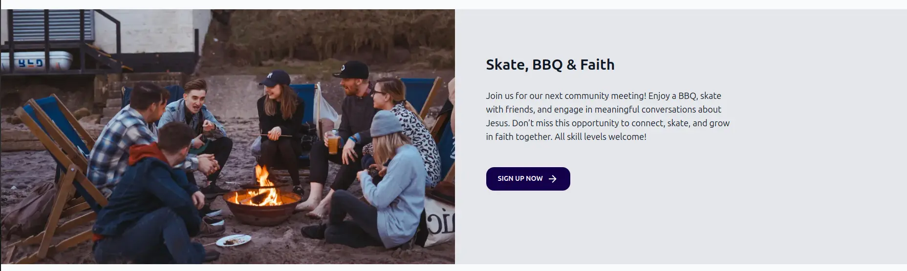

import { Aside } from "@astrojs/starlight/components"

If you have content to highlight, you can use the `HighlightSection` component. This component displays a large
image with a title, a description, and an optional link to another page.



It already includes a `Section` component to handle the layout. Here is an example of how to use it:

```astro
---
import { Page, HighlightSection } from "lightnet/components"
import highlightImage from "../../assets/highlightImage.jpg"

const { t, currentLocale } = Astro.locals.i18n
---
<Page>
    <HighlightSection
        image={highlightImage}
        title={t("highlight.title")}
        text={t("highlight.text")}
        link={{
            href: `/${currentLocale}/some-page`,
            text: t("highlight.link"),
        }}
    />
</Page>
```

Make sure you add your image to the `src/assets` folder and import it at the top of the file. 
We recommend using an image that is at least 1500 pixels wide so it looks good on all devices. The
image is optimized for performance. Supported image formats are `jpg`, `png`, and `webp`.

<Aside type="caution">
Test how the component is displayed on different screen widths.
</Aside>

For multilingual sites, make sure to pass translated strings for the `title` and `text` properties.

### Add custom components

Add your own components to the `HighlightSection` by wrapping them inside it.
Your components will be rendered below the text.

For example, this is how you could add two links:

```astro {6,7}
<HighlightSection
  image={highlightImage}
  title={t("highlight.title")}
  text={t("highlight.text")}
>
  <a href="https://bibleproject.com/">{t("home.bible-project")}</a>
  <a href="https://www.jesusfilm.org/">{t("home.jesus-film")}</a>
</HighlightSection>
```

## Reference

The `HighlightSection` component has the following properties. It can also wrap any component or HTML. Wrapped content appears
below the text:

### `image`

type: `ImageMetadata` \
example: `import highlightImage from "../../assets/highlightImage.jpg"` \
required: `true`

The image of the highlight section. It is optimized for performance.
We recommend using an image that is at least 1500px wide so it looks good on all devices. Supported image formats are `jpg`, `png`, and `webp`.

### `id`

type: `string` \
example: `"my-section"` \
required: `false`

The ID of the section. This can be used to link to the section, for example `/about#my-section`.

### `title`

type: `string` \
example: `t("highlight.title")` \
required: `false`

The title to show above the text.

### `text`

type: `string` \
example: `t("highlight.text")` \
required: `true`

The text to be displayed.

### `link`

type: `{ href: string, text: string }` \
example: `{ href: "/en/some-page", text: t("highlight.link") }` \
required: `false`

The link to show as a button below the text.
The `href` property is not automatically prefixed with the current locale.
The `text` is shown on the button.

### `className`

type: `string` \
example: `"bg-blue-600 text-white"` \
required: `false`

Additional CSS classes, separated by spaces, to style the highlight section.

### `titleClass`

type: `string` \
example: `"text-2xl font-bold"` \
required: `false`

Additional CSS classes, separated by spaces, to style the title.

### `textClass`

type: `string` \
example: `"text-lg"` \
required: `false`

Additional CSS classes, separated by spaces, to style the text.
