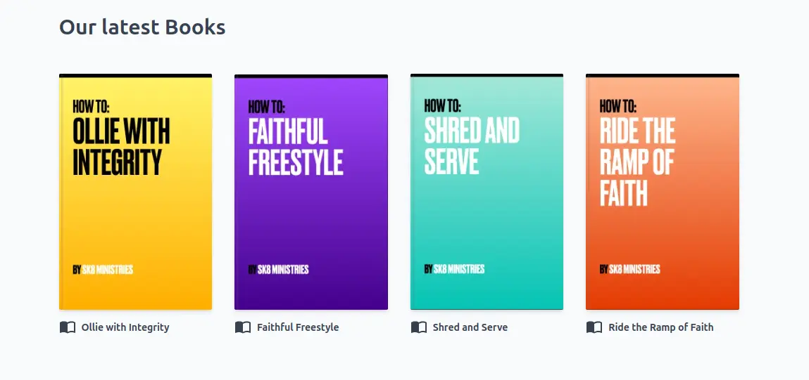

import { Aside } from "@astrojs/starlight/components";


You can add a gallery of media items to your page. This is a great way to showcase your content.
LightNet provides a `MediaGallerySection` component that displays a grid of media items.



Here is an example on how to use it:

```astro
---
import { Page, MediaGallerySection } from "lightnet/components"
import { getMediaItems } from "lightnet/content"

const someEnglishBooks = await getMediaItems({
  where: { type: "book", language: "en" },
  orderBy: "dateCreated",
  limit: 10
})

const { t } = Astro.locals.i18n
---

<Page>
    <MediaGallerySection 
        title={t("x.english-books.title")} 
        items={someEnglishBooks} 
        layout="book"
    />
</Page>
```

Inside the frontmatter the `someEnglishBooks` variable is prepared using LightNet's [getMediaItems function](/build/pages/query-media-items). 
The `MediaGallerySection` component displays them in a grid. It shows the title and image of each media item. 
The number of grid columns depends on the screen width.
Pass your media items to the `items` property. Also choose a layout to define the appearance of the gallery.

## Reference

The `MediaGallerySection` component has the following properties:

### `title`

type: `string` \
example: `"My Media Gallery Title"` \
required: `false`

Sets a title over the gallery.

### `items`

type: `MediaItem[]` \
example: `const books = await getMediaItems({/*...*/})` \
required: `true`

The array of media items to display.

### `layout`

type: `"book" | "video" | "portrait" | "landscape"` \
example: `"book"` \
required: `true`

The layout of the gallery. The layout is used to determine the number of columns and
to style the cover images. Available layouts are:

- `portrait`: Takes 2 to 5 columns. Use this for cover images that are portrait oriented.
- `book`: Takes 2 to 5 columns. This equals to `portrait` layout. Additionally a book fold is added to the cover image and corners are less rounded.
- `landscape`: Takes 1 to 4 columns. Use this for cover images that are landscape oriented.
- `video`: Takes 1 to 4 columns. This equals to `landscape` layout. Additionally all cover images have an aspect ratio of 16:9 with a black background.

<Aside>
So far, the `MediaGallerySection` is only available in `maxWidth: "wide"`.
</Aside>