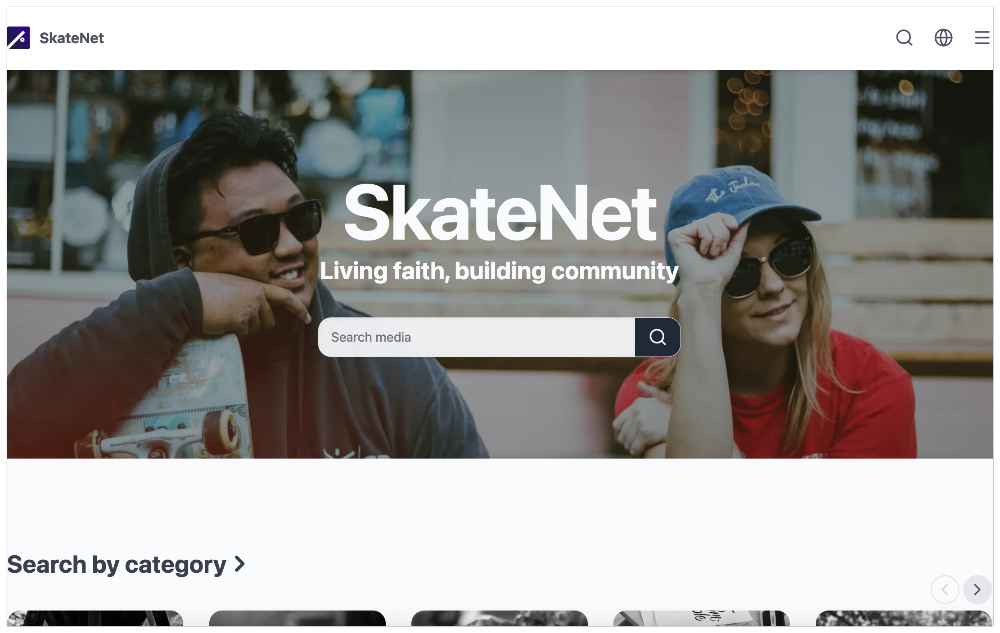
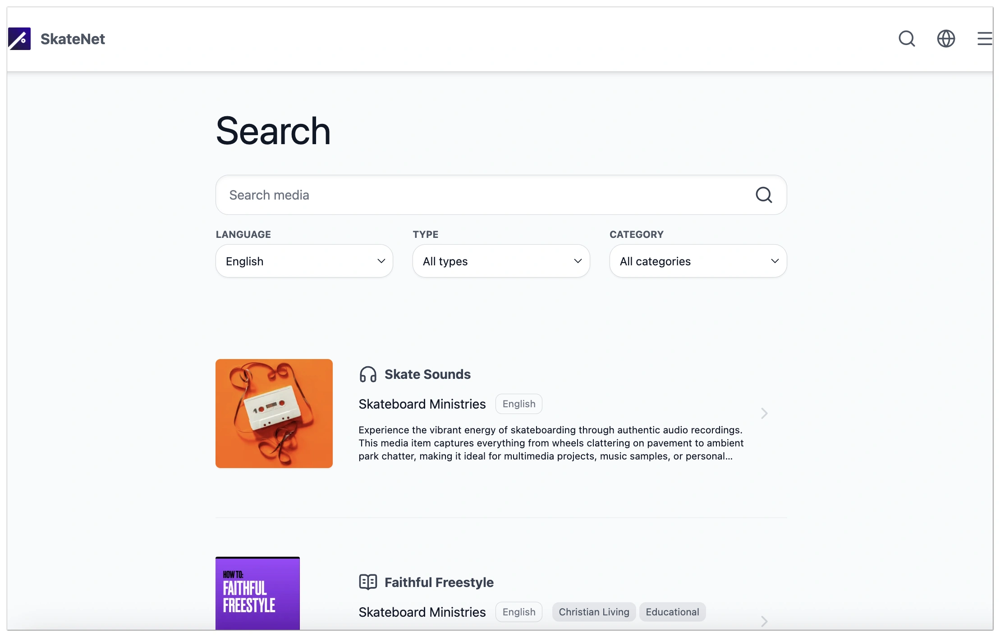
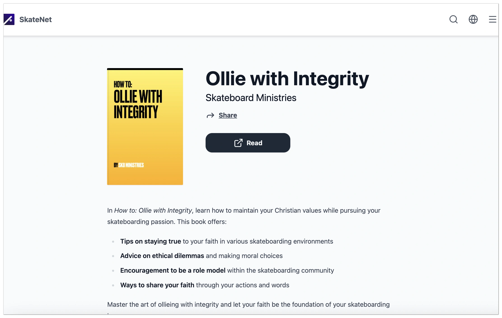
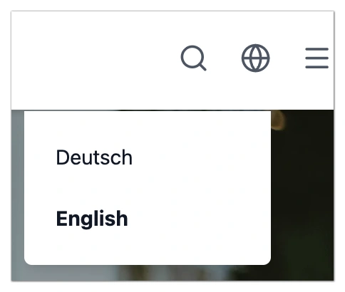
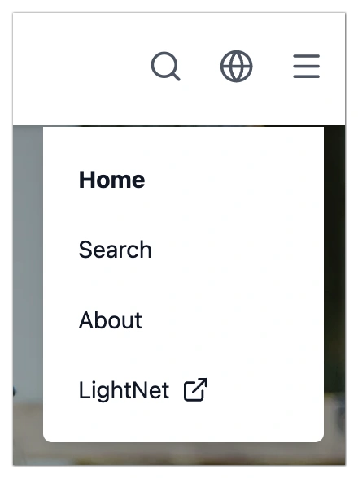
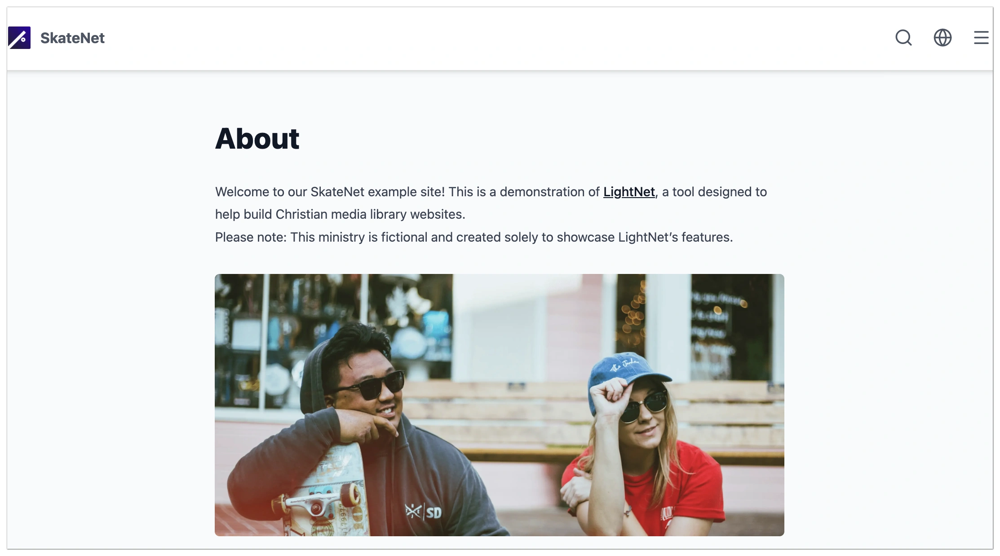

This page explains the structure of a media library built with LightNet and the implementation
details relevant to Site Administrators. It also explains key **LightNet terminology** used
throughout the documentation.

## Understanding media content in LightNet

LightNet supports a wide range of media formats in a single Media Library. The four broad
kinds most sites start with are:

- Videos
- Audio
- Images
- Documents

[**Media Types**](/content/media-types) are configurable. A site can use format-based names
such as Videos or Audio, or Ministry-specific names such as Sermons, Books, or Podcasts.
A Media Library can include multiple Media Types.

A [**media item**](/content/media-items) represents each piece of media content. Its metadata
is organized into the following fields:

- Title
- Content Language
- Media Type
- Cover image
- Content
- Date created
- Description
- Authors
- Categories

Content can be stored on the LightNet Site or hosted elsewhere and linked to it. In a
Media Item, use `upload` for site-managed files and `link` for external URLs. See
[Media Items](/content/media-items#content) for details.

## Site navigation

See [LightNet Site navigation](/ministry/concepts/site-navigation) for a user-facing
overview of what Users see and how they navigate a LightNet Site.

## Homepage

The [**homepage**](/build/pages/initialize-homepage) is a customizable landing page. A Site
Administrator can configure it to display selected media items in [**gallery views**](/build/pages/media-gallery-section).

## Search page

The Search Page is accessible from the [**Header Bar**](#header-bar) by clicking the
**magnifier icon**. It supports:
- Text searches for media items
- Filtering by [**Content Language**](/content/media-items#language), [**Media Type**](/content/media-types), or [**Categories**](/content/categories)

## Media item details page

The Media Item Details Page presents the Media Item's **metadata**, including its title,
description, cover image, and authors, and provides access to its **Content**.
The first Content entry is the primary Content, and any remaining entries are additional
Content. The layout of the Media Item Details Page is determined by its Media Type. The
selected layout controls how the cover image, Content, and metadata are displayed.

## Header bar

The [**Header Bar**](/build/configuration/initialize-configuration) appears at the top of each page and contains:
- An optional **site logo**
- **Site title**
- **Search** icon
- **Language Selection** menu
- **Main Menu** icon

### Language selection

The **Language Selection Menu** switches the **Site Language**. Selecting a different
Site Language changes the **locale** and displays the LightNet Site in the selected language.
This does **not** translate **Media Items**: their titles, descriptions, and other metadata
remain in the original **Content Language**.

### Main menu

The **Main Menu**, opened via the three-line "hamburger" icon, allows navigation to:
- Internal pages, including Static Pages
- External websites

The [Main Menu configuration](/build/configuration/set-main-menu) uses the `mainMenu`
option in `astro.config.mjs`. Each menu item defines a destination and a localized label.

## Footer

The optional [**footer**](/build/pages/footer) appears on every page. A Site Administrator
can configure footer text, links, and a “Powered by LightNet” credit.

## Static pages

Static Pages are custom pages that Site Administrators can create and link from the Main
Menu or Footer.

### About page

An About Page is a common example of a Static Page. Site Administrators can use it to
provide information about the Ministry or LightNet Site. See [Create an About Page](/build/pages/about-page) for details.

An About Page might include:

- A brief introduction to the site's purpose and mission
- Details about the organization or individuals behind the media content
- Contact information or links to related resources
- Copyright notices and legal disclaimers

