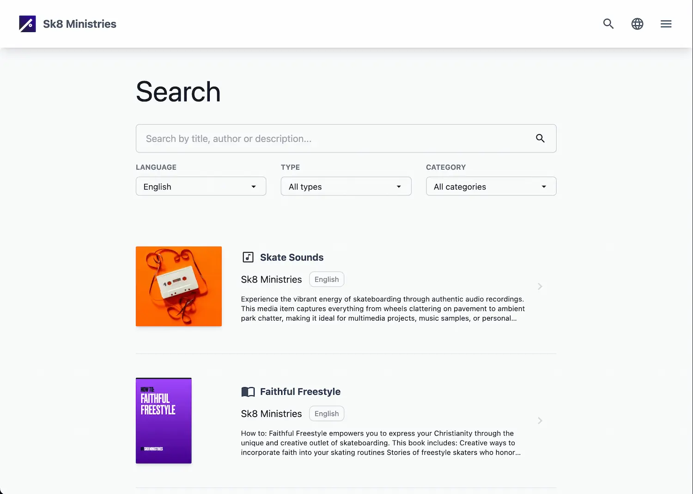

This chapter introduces the structure of a media library built with LightNet from the viewpoint of a site visitor. 
Along the way, it explains key **LightNet terminology**, which is used throughout the documentation.

## Understanding media content in LightNet

LightNet is designed for sharing [**media content**](/content/fundamentals/), which can include these [**media types**](/content/media-types):

- Videos
- Audio recordings
- Images
- Text (e.g. articles, books, PDFs)
- Downloadable files
- Links to external websites

Each piece of media content is represented by a [**media item**](/content/media-items), which contains **metadata** such as:

- Title
- Media type
- Description
- Cover image
- Authors
- Categories
- Links to the content

## Navigating a LightNet media library

Visitors enter a LightNet-powered site through the [**homepage**](/build/pages/initialize-homepage), a customizable landing page 
that welcomes them and displays a selection of media items in [**gallery views**](/build/pages/media-gallery-section).

At the top of the page, they see the [**header bar**](/build/configuration/initialize-configuration), which contains:
- The **site title**, with an optional site logo.
- Various **action icons**, which can include Search, Language Selection and Main Menu.

### Main menu

The **main menu**, which is opened via the three-line "hamburger" icon, allows navigation to:
- Other pages on the same site
- External links

### Language selection

Next to the main menu, visitors find the **language selection menu**, where they can choose their preferred 
**site language**. Selecting a different language changes the **locale**, meaning visitors are redirected to a version 
of the site in the selected language. However, this does **not** translate media items themselves—titles, descriptions, 
and other metadata remain in their original **content language**.

### Search page

The Search Page is accessible in the header bar by clicking the **magnifier icon**. On the **Search Page**, visitors can:
- Search for media items by a search text
- Filter by **content language**, **media type**, or **categories**
    - **Content language** refers to the language in which a media item's content is presented, such as the written 
        language of a book or the spoken language of a video.
    - **Media types** define the kind of content, such as "video" or "book."
    - **Categories** group media items by topic, such as "Theology" or "Life Support."

### About page

The [**About Page**](/build/pages/about-page) is accessible from the main menu and provides visitors with key information 
about the site. This page typically includes:

- A brief **introduction** to the site's purpose and mission.
- Details about the **organization** or individuals behind the media content.
- Contact information or links to related resources.
- Copyright notices and legal disclaimers.

### Media item details page

Selecting a media item from the homepage or search page leads to its **details page**. This page presents:
- The item's **metadata** (title, description, cover image, authors, etc.)
- A way to **view the content directly** or navigate to it via external links.

