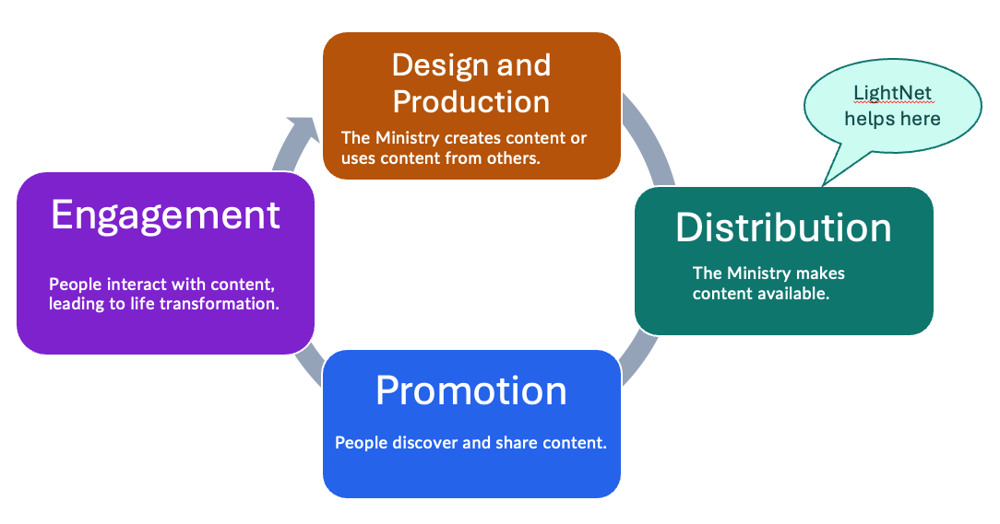

import { Aside } from "@astrojs/starlight/components";

A **Ministry** uses **Content**, such as videos, audio, images, and documents,
to share the gospel and strengthen believers in their communities. 

Content moves through four stages in a cycle. LightNet helps only with the Distribution stage.

## Design and Production

The Ministry plans and prepares Content for its audience. It may be the **Author** of
the Content, or it may use Content created by another person or organization. In either case,
this stage can include deciding what the audience needs, creating or selecting Content,
reviewing it, and preparing the files and information needed to share it.

Tools for this stage might include a plan for creating the Content, a script or storyboard,
camera and audio equipment, editing software, translation tools, and a review or approval process.

### Quality questions

- Is the Content clear, accurate, and fit for its purpose?
- Does it address a real need for the intended audience?
- Is the Content culturally appropriate and available in the needed languages and formats?

## Distribution

<Aside type="note" title="LightNet's scope">
LightNet focuses on the Distribution stage. The other stages remain important parts of
the Ministry's work, but they are outside the scope of LightNet. See [How LightNet
works](/ministry-docs/concepts/how-lightnet-works) to learn how LightNet supports
Distribution.
</Aside>

The Ministry makes Content available to people in its local community by publishing it on a website.

Tools for this stage might include a website and a tool for managing its Content.
A hosting service stores the Content and keeps the website available on the internet.

### Quality questions

- Can people access the Content on the phones, computers, and internet connections they use?
- Can people find the Content using the website's menus and search?
- Can people tell what the Content is about and which language it uses?

## Promotion

Through Promotion, people become aware of the Ministry's Content, find it,
and share it with others. Promotion helps connect the right Content with the people
who may benefit from it.

Tools for this stage might include word of mouth, posters with QR codes, email,
newsletters, social media, messaging apps, and partnerships with churches or community
organizations.

### Quality questions

- Are the people who need this Content becoming aware of it?
- Which ways of promoting the Content are most effective for the Ministry?
- Is the message clear about what the Content offers and how to access it?

## Engagement

Through Engagement, people interact with Content individually and in community,
leading to life transformation. Engagement may include reading, watching, listening,
discussing, applying, and sharing the Content.

Tools for this stage might include discussion groups, messaging or community platforms,
in-person gatherings, follow-up conversations, surveys, and feedback forms.

### Quality questions

- Are people interacting with the Content in the ways the Ministry intended?
- Is the Content contributing to meaningful change in people's lives?
- What are people saying or doing that could improve this or future Content?

## Analytics and learning

Analytics can be used to answer the quality questions in every stage. The Ministry can use
information from its strategy and activities to learn what is working, improve its efforts,
and inform future Content. Analytics should support Ministry goals and be interpreted
alongside direct feedback from the people the Ministry serves. The lifecycle is a cycle:
learning from Engagement can improve the Ministry's next round of Design and Production.

Analytics and feedback may show that Content should be revised, recreated, translated, or
retired. This helps the Ministry keep its Content relevant, accurate, and useful over time.
