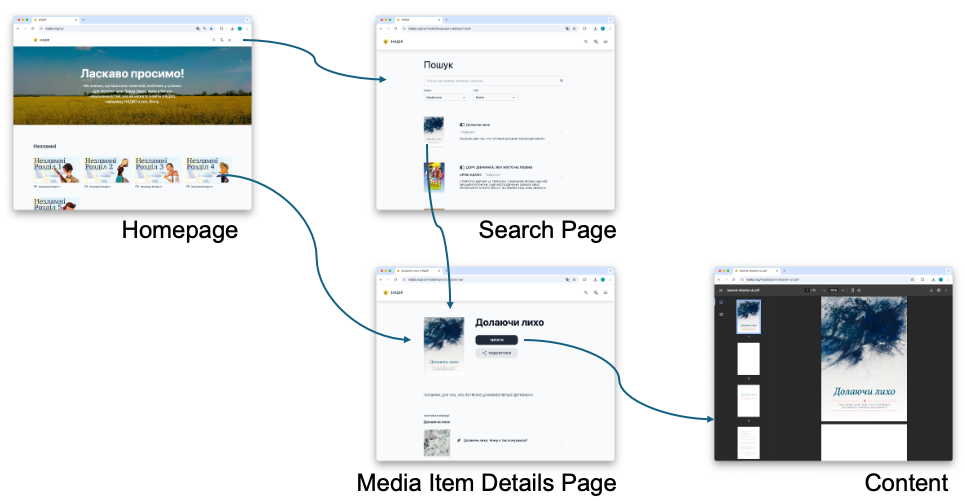

Users access a Ministry's **Content** through a LightNet Site in a web browser.
LightNet Site navigation includes three main pages, a standard Header Bar, optional Static
Pages, and an optional Footer.

## Main pages

The three main pages are the Homepage, Search Page, and Media Item Details Page.

### Homepage

The Homepage is the starting point for a LightNet Site. It introduces the site and helps
Users discover the **Media Items** in it. From the Homepage, a User can go to the Search Page,
select a Media Item shown on the Homepage, or open the Main Menu.

### Search page

The Search Page helps Users find Media Items in the site's **Media Library**. Users can
search for Media Items and use filters to narrow the results.

### Media Item details page

When a User selects a Media Item on the Homepage or Search Page, the Media Item Details
Page opens. It presents information about the Media Item, such as its title and description,
and provides access to the Content.

## Header bar

The standard LightNet page layout always includes a Header Bar. Its contents can vary
depending on how the LightNet Site is configured.

It contains an optional logo and the site title. It also provides access to the Search Page
and the Main Menu. When a LightNet Site supports more than one **Site Language**, the Header
Bar also includes the Language Selection Menu.

### Language selection menu

The Language Selection Menu allows Users to choose the **Site Language**. The Site Language
is the language of the site's user interface, including button labels, menus, and other
user interface elements.
Changing the Site Language does not change the **Content Language**. See also
[Languages](/ministry/concepts/languages).

### Main menu

The Main Menu is a navigation menu that provides access to the Homepage and Search Page.
It may also provide access to an About Page and other Static Pages.

## Footer

The Footer is optional. A Site Administrator can configure it to include the
[Language Selection Menu](#language-selection-menu), a short message such as a copyright
notice, links to [Static Pages](#static-pages) or external websites, and a “Powered by
LightNet” message.

## Static pages

Static Pages provide additional information for Users of the LightNet Site.
A Ministry can use them for any information it wants to make available. They are
typically accessed through the Main Menu.
In general, a LightNet Site should have only a small number of Static Pages.

### About page

An About Page is common, although some Ministries may not need one. An About Page can
share information about the Ministry or the LightNet Site, or provide contact information.

## Examples of LightNet Sites

The following sites show different ways Ministries can organize and share
their Content with LightNet:

- [MediaWorks Digital Library](https://library.mediaworks.global/) provides media
  resources in many languages for least-reached people groups.
- [Nadija – Hope](https://nadija.org/) provides Christian resources in Ukrainian.
- [Food for Thought](https://food-for-thought.mediaworks.global/) is a collection of
  articles relating the Bible to a wide variety of topics.
